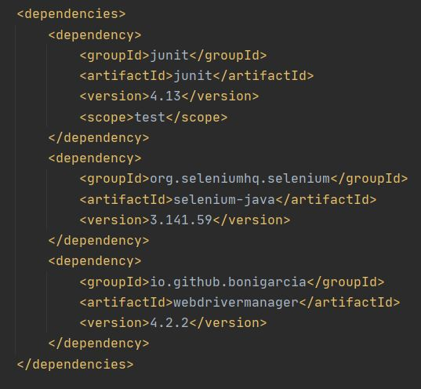
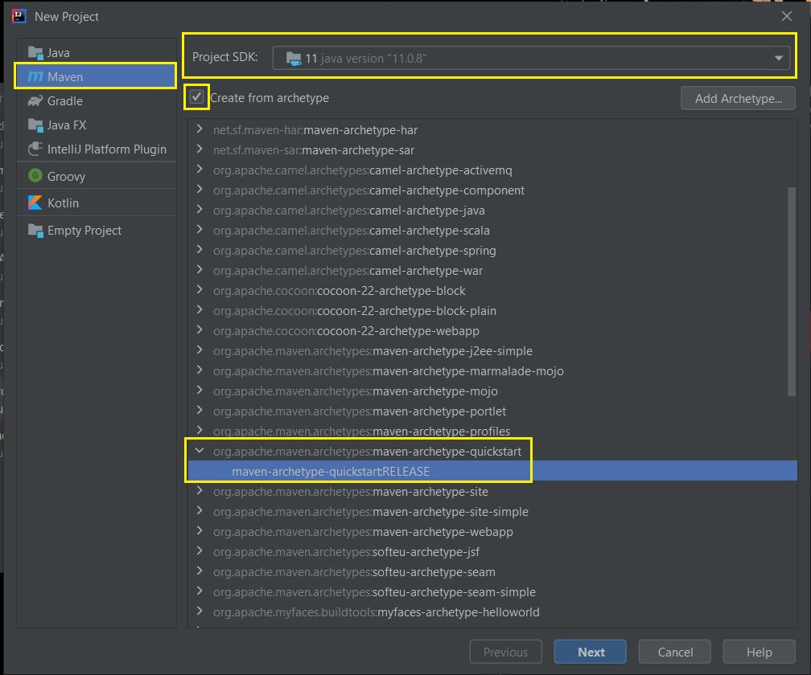
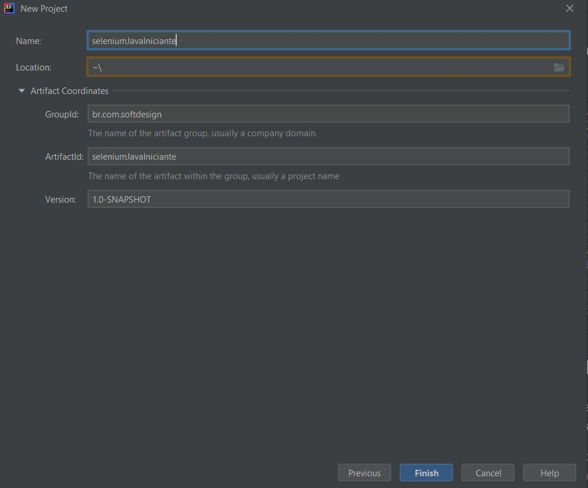
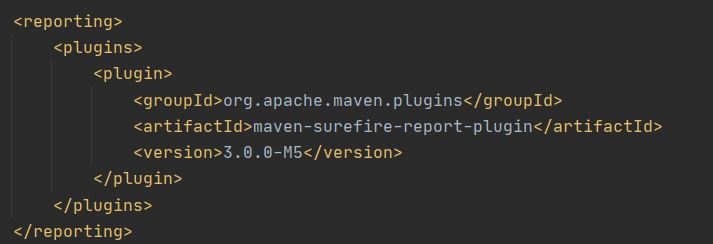
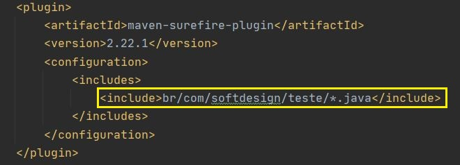

# Automação Web Utilizando Selenium com Java

## Requisitos

* JDK 8 ou superior <a href="https://www.oracle.com/br/java/technologies/oracle-java-archive-downloads.html" target="_blank">Página para download</a>
* Apache Maven <a href="https://maven.apache.org/download.cgi" target="_blank">Página oficial para dowload</a>

**Observação:** depois que fizer o download do Apache Maven, não se esqueça de adicioná-lo como uma variável de ambiente no seu sistema operacional.

## Ferramentas
* Selenium WebDriver <a href="https://www.selenium.dev/documentation/en/webdriver/" target="_blank">Documentação</a>
* WebDriverManager <a href="https://github.com/bonigarcia/webdrivermanager" target="_blank">Documentação</a>
* JUnit 4 ou superior <a href="https://junit.org" target="_blank">Página oficial</a>

### Dependências




## Configurar o projeto utilizando IntelliJ IDEA

Para facilitar a estrutura do projeto utilize as seguintes configurações inicias:

1. Selecione projeto **Maven**

2. Já com o JDK instalado, selecione a versão que irá utilizar (neste caso foi escolhida a versão 11)

3. Marque a opção **_Create from arquetype_**

4. Selecione a opção **_maven-archetype-quickstart:RELEASE_**

5. Clique em **Next**



## Nome do projeto e ids

1. Escolha o nome do projeto e os nomes dos seus respectivos ids

1. Clique em **Finish** e o Maven irá fazer as principais configurações do projeto 



### Configuração para gerar relatórios com o plugin surefire reports

* No arquivo pom.xml adione a seguinte configuração logo depois do final da tag ``<build>``



* Ainda no pom.xml adicione dentro da tag ``<plugins>`` a seguinte configuração:



**Observação:** o caminho informado na tag ``<include>`` vária de acordo com os nomes dos ids informados no início do projeto.

### Comandos para executar os testes

* Somentes testes: ```mvn test```
* Testes e gerar relatório HTML com plugin do Maven: ```mvn site ```

Depois que executar o comando para gerar os relatórios. O **Maven** irá criar um diretório chamado **target**, neste diretório terá outro diretório chamado **site**. Dentro dele terá um arquivo chamado **surefire-report.html**. Execute este arquivo em qualquer navegador para visualizar o relatório.

Caminho: ```target/site/surefire-report.html``` 